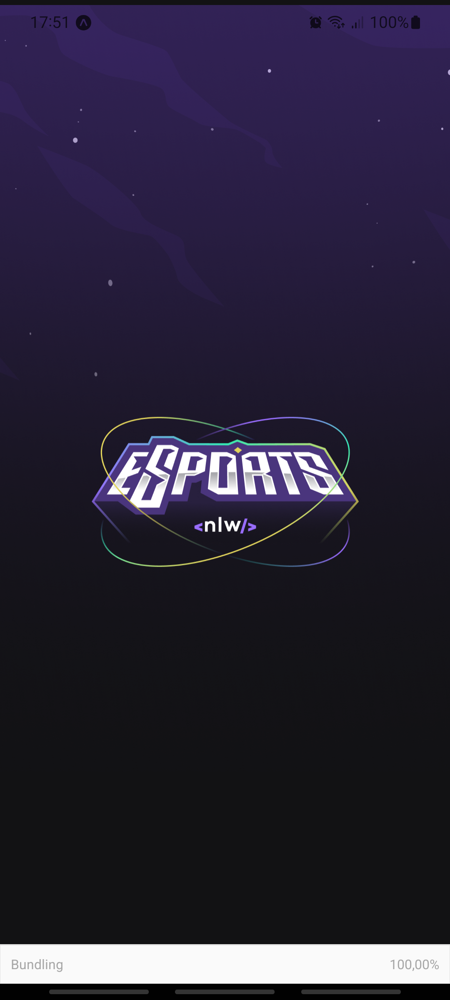
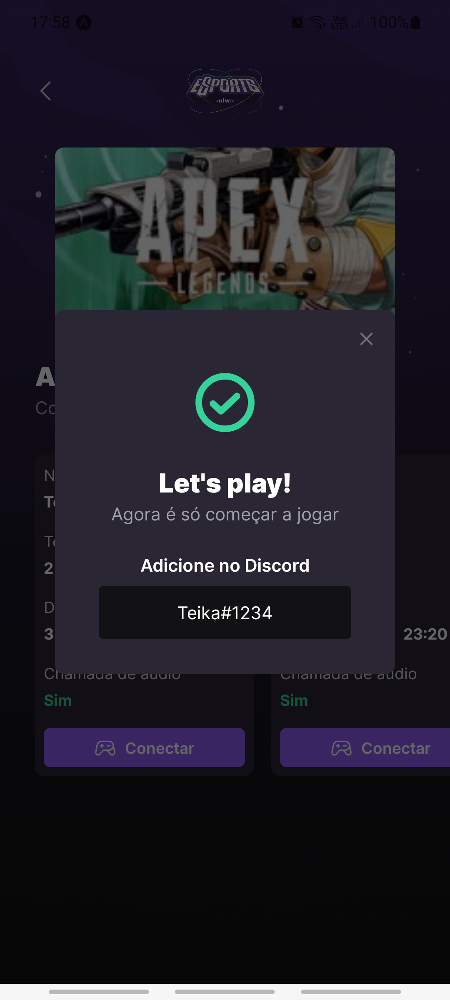

# Tabela de conteúdos
- **[Descrição](#descrição)**<br>
- **[Tecnologias](#tecnologias)**<br>
- **[Overview](#overview)**<br>
- **[Próximos passos](#próximos-passos)**<br>
- **[Visualisando o Projeto](#visualisando-o-projeto)**<br>

## Descrição 
  Este projeto tem como objetivo, aprofundar o conhecimento no desenvolvimento front-end, back-end e mobile.<br>
  ### Funções Web
  - Visualizar Jogos
  - Publicar anúncio

  ### Funções Mobile
  - Visualizar Jogos
  - Visualizar anúncios em cada jogo 
  - Conectar com o duo

## Tecnologias
  ### Linguagem
  - Typescript
  ### Front-End
  - React Native
  - Vite
  - Axios
  - Tailwind Css
  - Phosphor
  ### Back-End
  - SQL
  - Node.JS
  - Prisma
  - Express
  ### Mobile
  - React Native
  - Expo
  - Babel

## Overview


<div>
  
  
  
  
</div>

## Próximos passos
    - [] Design Responsivo
    - [] Validação - Zod
    - [] Validação de Formulários - React Hook Form(Schema Validation)
    - [] Carrousel(Para a lista de Jogos) - Keen-Slider
    - [] Autenticação 
    - [] Corrigir Select no formulário de anúncio - Radix UI
    - [] Notificações Remostas - Expo Notifications(expo-notifications)

## Visualisando o Projeto
  Após baixar o projeto entre nas pastas "server" e "web" e instale as dependencias com:
  ```
  npm install 
  ```
  
 Após a instalação utilize o comando para iniciar:

  O Web e o Servidor
  ```
  npm run dev
  ```

  O Mobile
  ```
  expo start
  ```
### **Para visualisar no Mobile é preciso ter o aplicativo [Expo](https://play.google.com/store/apps/details?id=host.exp.exponent&hl=pt_BR&gl=US)**

